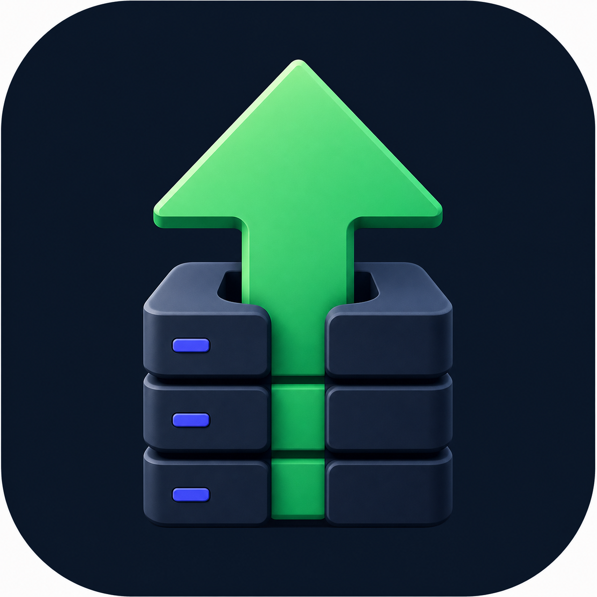
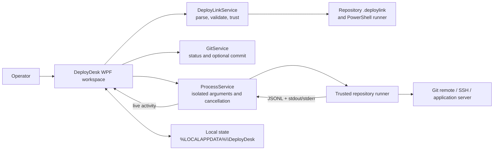

# DeployDesk

<div align="center">
  

  <h3>A calm Windows workspace for repeatable, repository-defined deployments.</h3>

  <p>
    DeployDesk keeps deployment logic where it belongs&mdash;in your repository&mdash;while giving
    operators one consistent place to review Git state, choose safe options, launch, observe,
    and cancel a deployment.
  </p>

  <p>
    
    
    
    
  </p>
</div>

> Your repository owns the deployment logic. DeployDesk provides the operator workspace.

DeployDesk is a lightweight WPF desktop application for Windows. A project describes its
non-secret deployment target and runner through a versioned `*.deploylink` file. DeployDesk
validates that contract, shows the local Git context, asks the operator to trust the exact link
and runner content, and starts the repository's PowerShell runner with live structured output.

## Why DeployDesk?

Deployment scripts are flexible, but running them manually across several projects makes it easy
to lose context. DeployDesk adds a focused control surface without replacing the automation that
already understands each application.

| Focus | What DeployDesk provides |
|---|---|
| Repository ownership | The runner remains versioned with the application it deploys. |
| Git awareness | See the active branch, working-tree changes, recent commits, pending commits, and the last successful DeployDesk run. |
| Explicit trust | Review the repository, runner, server target, remote path, and SHA-256 fingerprint before first use. |
| Predictable execution | DeployDesk supplies a small non-interactive PowerShell and JSON Lines contract. |
| Live operations | Follow normal output and structured events, copy the activity log, or cancel the entire runner process tree. |
| Project-specific controls | Expose safe boolean choices such as migrations or seed data from the repository's link file. |
| Multi-project workspace | Keep several deployment targets available in one desktop application. |
| Localized interface | Switch the complete interface between English and German; English is the default. |

## How it works

1. Add a repository's `*.deploylink` file using the file picker, drag and drop, or the registered
   Windows file association.
2. Review the repository, target, remote path, runner, and combined deployment fingerprint before
   granting trust.
3. Inspect Git state, choose repository-defined options, and decide whether DeployDesk should
   commit all local changes before deployment.
4. DeployDesk runs the trusted PowerShell runner without a console window and renders its output
   in real time. The runner remains responsible for Git push, SSH, server-side work, and health
   verification.



## Requirements

To run DeployDesk:

- Windows 10 or Windows 11 on x64;
- Git for Windows, available as `git.exe`;
- Windows PowerShell, available as `powershell.exe`;
- a Git repository containing a valid schema-v2 `*.deploylink` and compatible PowerShell runner;
- any tools required by that runner, commonly the Windows OpenSSH client.

The published application is self-contained, so users do not need to install the .NET runtime.
The pinned .NET SDK 8.0.422 (runtime 8.0.28) is required only for development and source builds.

## Quick start from source

```powershell
git clone <repository-url>
cd DeployDesk
dotnet restore DeployDesk.sln
dotnet build DeployDesk.sln
dotnet run --project src/DeployDesk/DeployDesk.csproj
```

Then add a compatible `*.deploylink` file. DeployDesk will display the deployment target and the
trusted files before it stores the project locally.

> DeployDesk does not currently publish an official installer or release from this repository.
> See [Development](docs/DEVELOPMENT.md) to build a self-contained package or local installer.

## Make a repository compatible

Place one link file per deployment target in the repository root, for example
`my-app-production.deploylink`:

```json
{
  "schemaVersion": 2,
  "project": {
    "id": "my-app-production",
    "name": "My App",
    "description": "Production deployment"
  },
  "repository": {
    "remote": "origin",
    "branch": "main"
  },
  "server": {
    "name": "Production",
    "host": "deploy.example.com",
    "user": "deploy",
    "sshPort": 22,
    "remotePath": "/srv/apps/my-app",
    "healthCheck": {
      "port": 3000,
      "path": "/health",
      "expectedStatus": 200,
      "attempts": 20,
      "intervalSeconds": 2
    }
  },
  "runner": {
    "type": "powershell",
    "file": "deploy/deploy.ps1",
    "protocol": "deploydesk-jsonl-v1",
    "arguments": []
  }
}
```

The runner accepts the DeployDesk control parameters and emits one JSON object per line when
`-OutputFormat JsonLines` is selected:

```json
{"type":"step","message":"Checking the server connection"}
{"type":"success","message":"Server is reachable"}
{"type":"completed","message":"Deployment completed"}
```

Normal stdout and stderr are also supported. A compatible runner must be non-interactive under
`-NonInteractive`, skip its own local commit logic under `-SkipLocalGit`, return a non-zero exit
code for failure, and report completion only after its health check succeeds.

Read the full [DeployLink specification](docs/DEPLOYLINK_SPEC.md) and
[repository integration guide](docs/DEPLOYDESK_AI_INTEGRATION.md) before implementing a runner.

## Settings

Open the settings drawer from the gear button in the custom title bar. Settings are stored locally
under the `settings` section of `%LOCALAPPDATA%\DeployDesk\state.json`.

| Setting | Available values | Default |
|---|---|---|
| Language | English, German | English |
| Automatic repository status refresh | On or off | On |
| Refresh interval | 5, 15, 30, or 60 seconds | 5 seconds |
| Confirm before deployment | On or off | On |
| Clear activity log before deployment | On or off | On |
| Follow runner output | On or off | On |

Language changes update the interface immediately. “Follow runner output” controls whether the
activity view automatically scrolls as new runner output arrives.

## Security model

DeployDesk intentionally separates non-secret deployment metadata from credentials:

- `.deploylink` files may contain a hostname, user name, port, path, and health-check metadata,
  but must never contain passwords, tokens, private keys, `.env` content, or connection strings;
- credentials remain in the SSH agent, the user's SSH configuration, an operating-system secret
  store, or a server-side secret store;
- runner and link paths are resolved canonically, and the runner must exist inside the selected
  Git repository;
- runner arguments are passed as individual process arguments rather than interpolated shell text;
- changing the link file or the runner changes the SHA-256 trust fingerprint and blocks execution
  until the operator imports and approves the project again.

The trust fingerprint covers only the selected `*.deploylink` and runner file. It does **not**
attest to the entire repository or to scripts and modules loaded by the runner. Review repository
changes before deployment. DeployDesk accepts a deployment only when the configured branch is
checked out, the runner exits with code `0`, no structured `error` event was observed, and a
structured `completed` event was received. The runner remains responsible for strict validation,
safe SSH host-key checking, secret-safe logs, and honest health verification.

If “commit changes before deployment” is enabled, DeployDesk executes `git add -A`, which includes
all tracked and untracked changes in the repository. This option defaults to off. Enabling it
requires an explicit deployment confirmation that shows the current Git status; review every path.
DeployDesk also blocks automatic commits for common secret-bearing filenames such as `.env`,
private-key formats, credential stores, and publish profiles. This is defense in depth, not a
replacement for a real secret scanner or careful review.

See [SECURITY.md](SECURITY.md) for the full threat model, current limitations, and reporting
instructions.

## Build, test, and package

```powershell
# Build the application and smoke-test harness
dotnet build DeployDesk.sln

# Exercise WPF startup and the deployment animation
dotnet run --project tests/DeployDesk.SmokeTests/DeployDesk.SmokeTests.csproj -- --ui-animation

# Exercise hardened DeployLink validation with disposable fixtures
dotnet run --project tests/DeployDesk.SmokeTests/DeployDesk.SmokeTests.csproj -- --security-validation

# Validate a real compatible repository without deploying it
dotnet run --project tests/DeployDesk.SmokeTests/DeployDesk.SmokeTests.csproj -- C:\path\to\project.deploylink

# Create a self-contained Windows x64 publish folder
.\scripts\publish.ps1

# Verify that the published GUI creates a responsive window
.\scripts\smoke-start.ps1
```

The publish folder can contain native WPF companion libraries in addition to `DeployDesk.exe`.
Distribute the complete `artifacts\publish` directory or build the Inno Setup installer; do not
assume that copying only the executable is sufficient.

## Documentation

| Document | Purpose |
|---|---|
| [User guide](docs/USER_GUIDE.md) | Installation, projects, trust, deployments, settings, local data, and troubleshooting. |
| [Architecture](docs/ARCHITECTURE.md) | Components, data flow, lifecycle, persistence, and security boundaries. |
| [DeployLink specification](docs/DEPLOYLINK_SPEC.md) | Schema-v2 fields, validation rules, runner parameters, and JSONL protocol. |
| [Development guide](docs/DEVELOPMENT.md) | Repository layout, build, smoke tests, publishing, installer creation, and release checks. |
| [AI integration guide](docs/DEPLOYDESK_AI_INTEGRATION.md) | A normative workflow for adapting an existing repository safely. |
| [Security policy](SECURITY.md) | Vulnerability reporting, threat model, safe runner rules, and current limitations. |
| [Contributing guide](CONTRIBUTING.md) | Scope, workflow, quality expectations, and pull-request guidance. |

## Project status

DeployDesk is currently version `0.3.0`. The repository includes a Windows build, WPF smoke,
security-validation, and dependency-audit CI workflow. It does not yet provide official release
artifacts, an updater, or signed binaries. The included test project remains a focused smoke and
validation harness rather than a comprehensive unit-test suite.

Contributions are welcome; start with [CONTRIBUTING.md](CONTRIBUTING.md). This repository currently
does not contain a license file, so do not assume rights beyond viewing and contributing through
the repository until the project owner selects and adds a license.
