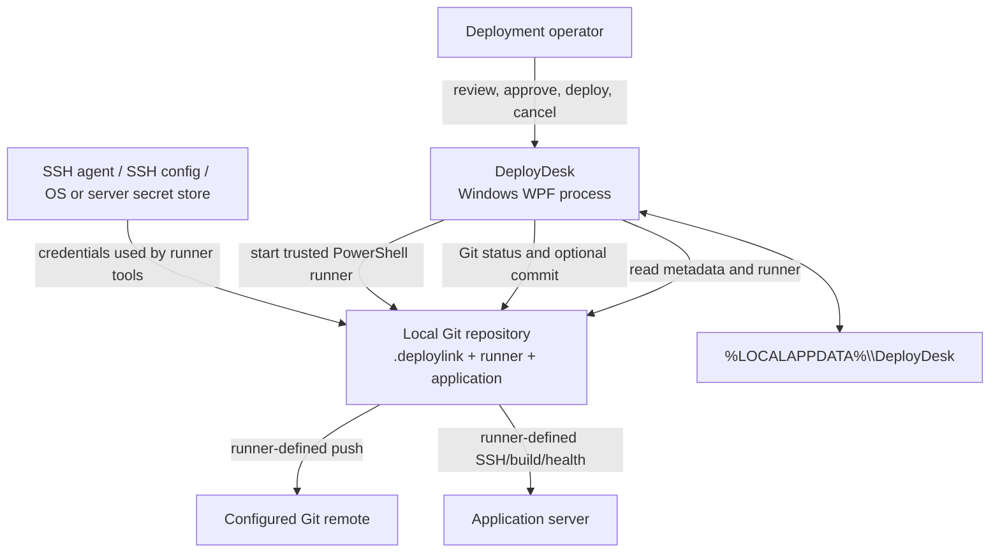

# DeployDesk Architecture

This document describes the current architecture and its security boundaries. It is intended for
maintainers, reviewers, and contributors. For operator behavior, see the
[user guide](USER_GUIDE.md). For the repository contract, see the
[DeployLink specification](DEPLOYLINK_SPEC.md).

## Design goals

DeployDesk is intentionally small. Its responsibilities are to:

- present several local deployment targets in one Windows workspace;
- make local Git state visible before an operator acts;
- validate and trust a narrow repository-owned deployment contract;
- invoke an approved runner with predictable arguments;
- surface the runner's output without adding a second deployment engine; and
- retain only the local state required for continuity and safety.

The repository runner remains responsible for project-specific validation, pushing, SSH, remote
commands, builds, migrations, secrets, and health verification.

## System context



DeployDesk itself has no network client for Git hosting, SSH, or health checks. Network effects are
created by `git.exe` when used by repository automation and by commands executed by the runner.

## Technology and packaging

| Area | Current choice |
|---|---|
| UI | Windows Presentation Foundation (WPF) |
| Runtime | .NET 8, `net8.0-windows` |
| Target | Windows x64 |
| Process integration | `System.Diagnostics.Process` with redirected UTF-8 stdout/stderr |
| Configuration | JSON `*.deploylink`, schema version 2 |
| Runner | Windows PowerShell via `powershell.exe` |
| Runner protocol | `deploydesk-jsonl-v1` plus ordinary output |
| Persistence | JSON in `%LOCALAPPDATA%\DeployDesk\state.json` |
| External packages | No third-party NuGet package references in the current projects |

The application is published self-contained with single-file publishing enabled. WPF native
dependencies can still appear beside the main executable, so the complete publish directory is
the deployment unit unless an installer packages it.

## Source layout

```text
DeployDesk.sln
├── src/DeployDesk/
│   ├── App.xaml(.cs)                 application resources and lifecycle
│   ├── MainWindow.xaml(.cs)          workspace UI and orchestration
│   ├── Models/                       link, state, and presentation models
│   └── Services/                     configuration, Git, process, and state services
├── tests/DeployDesk.SmokeTests/      console-driven integration and WPF smoke harness
├── docs/                             operator, protocol, architecture, and development docs
├── scripts/                          publish and published-start checks
└── installer/                        Inno Setup definition
```

## Component responsibilities

### `App`

`App` owns application startup and global exception handling. It:

- creates and shows `MainWindow`;
- passes the first command-line `*.deploylink` argument to the import workflow;
- records startup and unhandled exception details in `startup.log`; and
- shows a fatal startup message before shutdown.

No deployment operation is started automatically from a command-line link. The normal trust flow
still applies.

### `MainWindow`

`MainWindow` is the composition root and presentation controller. It creates the services, owns
observable UI collections, coordinates initialization and selection, refreshes Git data, manages
the trust and deployment workflows, streams logs onto the UI dispatcher, and persists state.

Important runtime controls include:

- a short dispatcher timer that batches process output before updating the log view;
- an optional repository refresh timer with 5, 15, 30, and 60 second settings;
- an in-progress flag that prevents deployment and refresh overlap;
- a refresh gate that prevents concurrent status refreshes; and
- a cancellation token plus process-tree termination for the active runner.

The window also owns the settings drawer and applies the English or German resource values to the
live interface. English is the default.

### `DeployLinkService`

`DeployLinkService`:

1. canonicalizes and checks the selected `.deploylink` path;
2. caps link input at 1 MiB, JSON depth at 32, and rejects duplicate or unknown properties;
3. deserializes JSON with comments and trailing commas allowed;
4. validates supported schema, identifier, server, repository, health, runner, option, and web-link values;
5. asks `GitService` for the enclosing repository root;
6. resolves the runner path, including filesystem links and junctions, relative to that root; and
7. rejects a missing runner, a runner over 16 MiB, or a runner that resolves outside the repository.

The checked-in JSON Schema is the public contract, but the application does not currently execute
a general JSON Schema engine. The service mirrors the critical schema constraints with explicit
runtime checks, including strict object members. Schema and runtime validation must still be kept
synchronized deliberately.

### `GitService`

`GitService` is a small adapter around a trusted, absolute Git for Windows executable path. It uses
`-C <root>` and discrete process arguments, disables repository hooks and filesystem monitors for
its own operations, and obtains:

- repository root;
- current branch and `HEAD`;
- porcelain worktree changes;
- up to 15 recent commits; and
- the number of commits after the last locally recorded deployed commit or configured remote
  branch.

For the optional automatic commit, it executes `git add -A` and `git commit -m <message>`.
Deployment push behavior is not part of this service; it belongs to the runner.

### `ProcessService`

`ProcessService` is the common process boundary for Git and runner execution. It:

- sets the working directory explicitly;
- disables shell execution and visible console creation;
- adds each argument through `ProcessStartInfo.ArgumentList`;
- redirects stdout and stderr with UTF-8 decoding;
- streams lines to optional callbacks while retaining bounded captured output;
- caps each captured stream at 1,000,000 characters and each UI callback line at 16,384 characters;
- returns the exit code and captured output; and
- kills the entire process tree on cancellation.

Using an argument list avoids constructing a command-line string from configuration values. It
does not make a trusted runner safe by itself: the runner still interprets its own values and can
start other processes.

### `StateService`

`StateService` serializes `AppState` to `%LOCALAPPDATA%\DeployDesk\state.json`. Saves use a unique
temporary file and an overwrite move, with short retries for transient I/O failures. A malformed
JSON state file is treated as empty state.

State includes:

- absolute paths of imported link files;
- project-keyed last deployed commit and local time;
- project-keyed trusted deployment fingerprints; and
- application settings, including language, refresh, confirmation, log-clearing, and output-
  following choices.

It is local convenience and safety state, not a shared deployment ledger.

## Project import lifecycle

```mermaid
sequenceDiagram
    actor Operator
    participant UI as MainWindow
    participant Link as DeployLinkService
    participant Git as GitService
    participant State as StateService

    Operator->>UI: Select, drop, or open .deploylink
    UI->>Link: LoadAsync(path)
    Link->>Git: Find repository root
    Git-->>Link: Canonical root
    Link->>Link: Validate config and confined runner
    Link-->>UI: Resolved DeployLink
    UI->>UI: SHA-256(runner + separator + link)
    UI-->>Operator: Show repository, target, runner, fingerprint
    alt Approved
        UI->>State: Save path and trust fingerprint
        UI->>Git: Refresh status
    else Rejected
        UI-->>Operator: Leave project unchanged
    end
```

On later startup, saved projects are loaded only when the current link and runner fingerprint
matches local trusted state. A missing, invalid, or changed project is removed from the restored
project-path list and must be imported again.

## Refresh lifecycle

For the selected project, refresh starts these Git queries concurrently:

- branch;
- worktree status;
- recent commits; and
- pending commit count.

Results are applied only if the same project remains selected. Automatic refresh is controlled by
settings; when enabled, it uses the selected interval. Refresh does not run during deployment.

## Deployment lifecycle

```mermaid
sequenceDiagram
    actor Operator
    participant UI as MainWindow
    participant Git as GitService
    participant Proc as ProcessService
    participant Runner as Repository runner
    participant State as StateService

    Operator->>UI: Deploy
    opt Confirmation enabled
        UI-->>Operator: Confirm target and action
        Operator->>UI: Approve
    end
    UI->>UI: Recalculate and compare trust hash
    UI->>Git: Verify configured branch is checked out
    UI->>Git: Read working-tree changes
    opt Changes exist and auto-commit is selected
        UI->>Git: git add -A; git commit
    end
    UI->>Git: Read candidate HEAD
    UI->>Proc: absolute system PowerShell path + discrete arguments
    Proc->>Runner: Start in repository root
    loop For each output line
        Runner-->>Proc: stdout / stderr / JSONL
        Proc-->>UI: Queue activity and status
    end
    alt Exit 0 + completed event + no error event
        Proc-->>UI: Success
        UI->>State: Save candidate commit and time
    else Non-zero or cancellation
        Proc-->>UI: Failure or cancelled
        UI-->>State: Do not update deploy history
    end
    UI->>Git: Refresh repository status
```

The runner command uses the absolute Windows system path equivalent of:

```text
powershell.exe -NoProfile -ExecutionPolicy Bypass -File <runner>
```

DeployDesk appends configuration arguments and its reserved contract flags. The execution policy
bypass is intentional so a reviewed repository runner can run consistently; the import prompt and
fingerprint are the local approval boundary.

## Runner output path

Runner stdout and stderr are read concurrently on background tasks. Lines enter a concurrent
queue. The UI timer processes bounded batches to avoid repainting for every line, formats
recognized JSON objects, retains at most 10,000 queued lines, limits the displayed buffer to
approximately 200,000 characters, and
optionally scrolls to the end according to the **Follow runner output** setting.

The activity view is not a durable audit log. It can be cleared automatically before a deployment,
remains memory-only, and can be copied manually.

## Trust and security boundaries

### Inside the DeployDesk boundary

- canonical link, repository, and runner path resolution;
- runner confinement to the repository root;
- runtime validation of supported configuration values;
- explicit first-use target and runner approval;
- SHA-256 change detection for the link and runner files;
- discrete process arguments;
- absolute Git and Windows PowerShell executable resolution;
- configured-branch and terminal JSONL success enforcement;
- local process cancellation; and
- state persistence under the current Windows user profile.

### Outside the DeployDesk boundary

- authorship or authenticity of repository content;
- integrity of files other than the trusted runner and link;
- behavior of imported modules or child scripts;
- Git remote authorization and branch protection;
- SSH identity, agent state, and host-key verification;
- remote command quoting and validation;
- server provisioning, secrets, containers, migrations, and rollback;
- health-check correctness; and
- confidentiality of text emitted by the runner.

The application records success only when the runner exits with code `0`, no structured `error`
event was observed, and a structured `completed` event was received. These checks detect protocol
contradictions but do not independently prove the server's health; truthful runner behavior remains
part of the trust boundary.

## Known architectural limitations

- `MainWindow` currently combines presentation and orchestration rather than using a fully
  separated MVVM layer.
- Runtime configuration checks are handwritten rather than driven by the checked-in JSON Schema.
- Trust covers two files, not a dependency graph or signed repository revision.
- Project state is keyed by project ID; duplicate active IDs are rejected during import and restore.
- Deployment history is local and records the runner's process/protocol result, not an independently
  observed server state.
- There is no updater, release signing, built-in rollback, credential manager, durable audit log,
  or remote deployment lock.
- The test project provides focused smoke and integration checks, not broad unit or end-to-end
  coverage.

## Evolution guidelines

When extending DeployDesk:

1. Keep repository execution explicit and visible to the operator.
2. Treat link and runner inputs as untrusted until validation and approval complete.
3. Preserve `ArgumentList`-based process invocation.
4. Do not move credentials into `*.deploylink`, application state, or activity logs.
5. Update the schema, runtime validation, specification, integration guide, and smoke checks
   together when changing the contract.
6. Keep English and German UI resources complete for every user-visible string.
7. Make new persistent settings backward-compatible with missing fields and safe defaults.
8. Document whether a new feature belongs to DeployDesk or remains the runner's responsibility.
